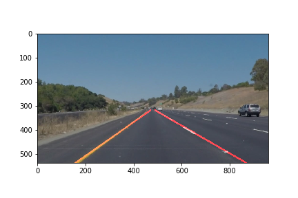

## Udacity self driving car project 1: Find lane lines

P1-nochallenge.ipynb: This code not cover the challenge part yet. Will update when challenge part is done.

test_images/ directory contains image files used for testing. When run the python notebook, output will be generated under test_images_output dir.

test_videos/ contains videos for testing. 

[writeup_p1.md](writeup_p1.md) explains the pipeline.

Here are the final results on test images:

